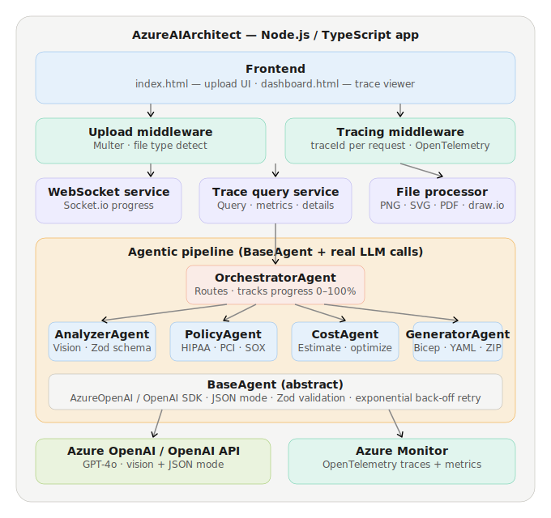
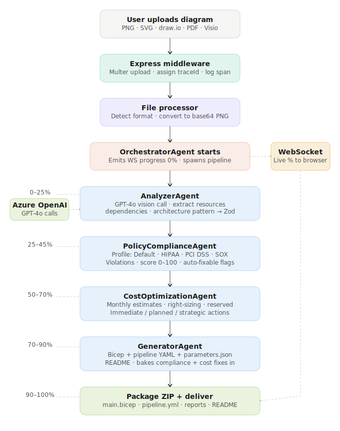

# Diagrams

This folder contains architecture and flow diagrams for the `feat/true-agentic-architecture` branch.

## Architecture diagram

`architecture-diagram.svg` — Full system structure showing:
- Frontend layer (upload UI + trace dashboard)
- Express middleware (Multer upload + tracing)
- Services layer (WebSocket, trace query, file processor)
- Agentic pipeline (Orchestrator → Analyzer → Policy → Cost → Generator)
- BaseAgent abstract class (AzureOpenAI SDK, Zod validation, retry logic)
- External integrations (Azure OpenAI / OpenAI API + Azure Monitor)

## Flow diagram

`flow-diagram.svg` — End-to-end request journey showing:
- User uploads a diagram file
- Middleware assigns a traceId
- File processor normalises to base64 PNG
- OrchestratorAgent spawns the 4-agent pipeline
- Each agent runs in sequence with WebSocket progress updates (0–100%)
- Final ZIP is packaged and delivered for download

